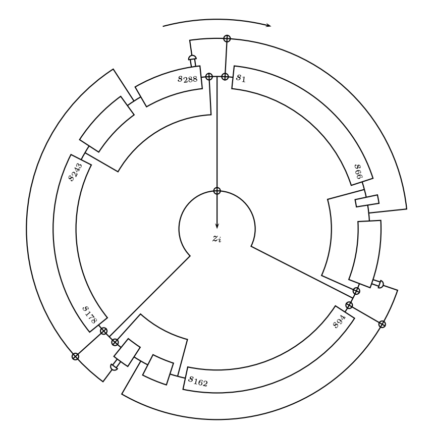

# trivium
Python implementation of the trivium stream cipher

Python class for the implementation of the Trivium synchronous stream cipher. The Trivium 
cipher is initialized by writing an 80-bit key and an 80-bit initialization vector (IV) 
to the 288-bit internal state and updating 4 x 288 = 1152 rounds. Each subsequent update 
generates a single output bit. In this implementation, the key and IV values are input as
strings which are then converted into 8-bit ASCII values. If either key or IV is not given,
the tool produces random 80-bit values by default. The default output format for bitstream,
key, and IV is hexadecimal; using the binary switch (-b) will produce binary output.

To implement trivium as a command-line tool, triv.py and the trivium.py
wrapper should be installed in the same directory.

## Usage:

trivium.py -n <number of output bits> -k <key string> -i <IV string> -b [binary output]

### Example:
trivium.py -n 256 -k bunnicula

### Output:
Bitstream: 0x6bbbcdbb37dcffae5b9613087f17003994390df7e8d6116c3cb7d89180c9c2f6

IV: 0x2c496362c5976dd074ec

Key: 0x62756e6e6963756c61

The specifications for the Trivium cipher are available at:
https://www.ecrypt.eu.org/stream/ciphers/trivium/trivium.pdf
